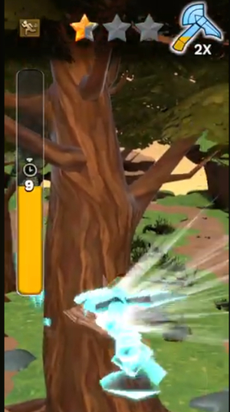
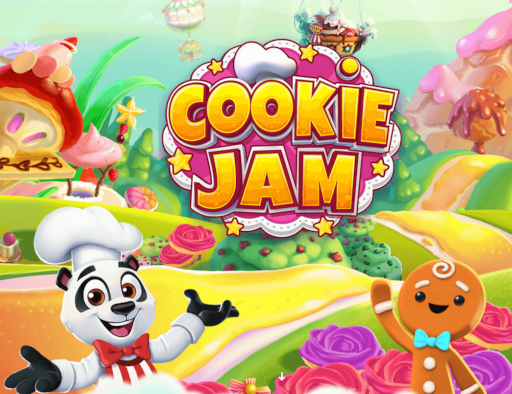
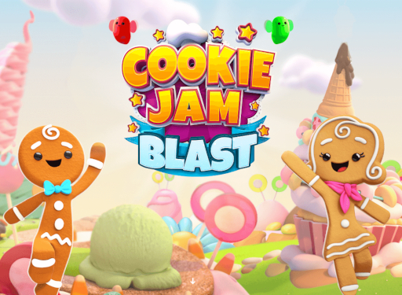
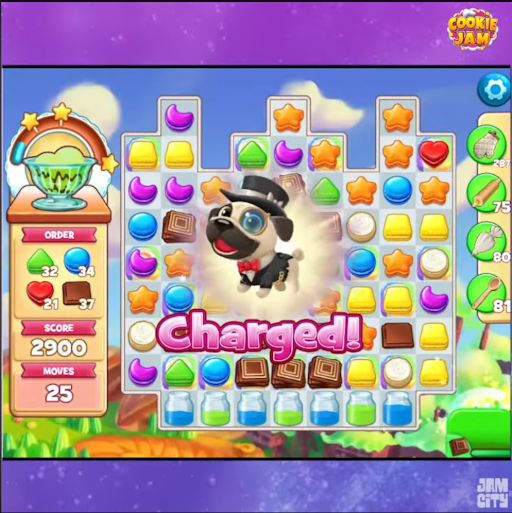
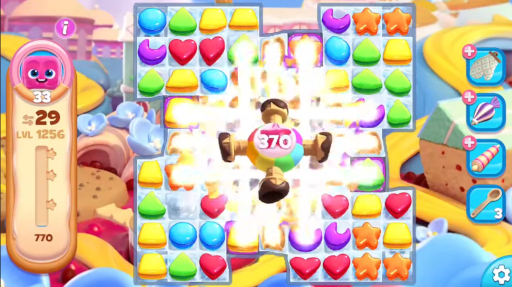
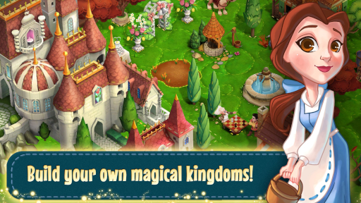
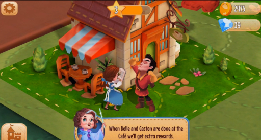
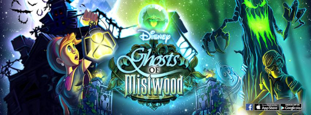

---
# Alex Schneider Portfolio

As a game software engineer with over 10 years of experience, primarily in the mobile space with Unity/C#, I've worked on many different aspects of game programming including gameplay, UI, tools, platform, memory management/optimization, and app life-cycle. I have lead small teams of ~3-5 other people to deliver fully fleshed out features in both production and live-ops environments.

Ideally, I am looking for a small to medium sized game team to join and contribute to - though I am open to discussing other roles, especially those that might benefit from my C# experience that aren't in the game development space. I would also be open to any roles that involve development using the Godot game engine as this is an engine I have enjoyed using for personal projects with both their scripting language and C#.

## Professional Projects

### Mythwalker

''

#### Links:

<a href="https://www.youtube.com/watch?v=RDkacY7LllQ">Gameplay footage</a>

<a href="https://www.youtube.com/watch?v=IDrlckQxy0E">Launch Trailer</a>

This game was sunset and is no longer available on the Google or Apple App Stores.

#### Description and Contributions

Mythwalker was a mobile, geo-location RPG built with Unity. The game featured action combat, customizable characters, resource gathering minigames, and multiplayer. I took lead on the Unity Addressables/Bundles on this project, as well as did some gameplay, memory optimization, and app-life cycle work.

Click to read more...

One of my major focuses on this project was to manage the assets and Unity Addressables integration. I created a code service in our project to control the loading, unloading, and downloading of all assets within the project. This unified and simplified the way the project interacted with this system and allowed for more overall consistency in the project, as well as reducing the number of loading issues. 
 
 
Additionally, I re-organized the assets in the project and set up the bundle and Addressable groups to follow this organization to allow for better groupings of assets. This helped with later memory optimization work I did because the connections and dependencies between various assets were both better defined and easier to control, ultimately leading to multiple fixes to memory issues on lower end mobile devices.
 
 
I worked closely with the art and design teams to create tools for them to interact with this Addressables system. The tools enabled the art and design teams to minimize the time spent on adding their new assets into the Addressable system as well as eliminated the majority of all problems the teams faced in the past.
 
 
My efforts on the Addressables system for Mythwalker ultimately led to resolving the majority of issues the project was facing with loading assets and greatly simplified the pipeline for getting new assets into the game and functioning properly.
 
 

 
Woodcutting Minigame
 
 
I also led a team of 3 other engineers, a designer, and an artist to rebuild the game's minigame system. I developed an updated design for the code system and coordinated with the other engineers on the implementation details. I built out the framework and general flow, while the other engineers synced up with me to hook in improvements to various gameplay elements. I would collaborate with the designer to ensure the feature was satisfying their requirements for both gameplay feel and for the control over the rewards and difficulty they needed. Throughout the process, I acted as the primary point of contact for the production team to communicate with them about progress, blockers, and anything else related to the development.

### Cookie Jam and Cookie Jam Blast

#### Links

Cookie Jam App Store links: 

<a href="https://play.google.com/store/apps/details?id=air.com.sgn.cookiejam.gp">Google Play Store</a>

<a href="https://apps.apple.com/us/app/cookie-jam-match-3-games/id727296976">Apple App Store</a>

Cookie Jam Blast App Store links: 

<a href="https://play.google.com/store/apps/details?id=air.com.sgn.cookiejamblast.gp">Google Play Store</a>

<a href="https://apps.apple.com/us/app/cookie-jam-blast-match-3-game/id1034920425">Apple App Store</a>

Video Links:

<a href="https://www.youtube.com/watch?v=SAF8OP3FIek">Cookie Jam Pets Feature</a>

<a href="https://www.youtube.com/watch?v=EHU8LUrCOnQ">Cookie Jam Blast Airship Power Demonstration</a>

#### Description and Contributions

Cookie Jam and Cookie Jam Blast are both match-3 puzzle games available on iOS and Android mobile devices, with Blast being a pseudo sequel. Both games started as Flash/ActionScript3.0 games with their own code bases, but a large portion of the work I contributed to these projects was when we ported the games over to Unity + C# and creating our own internal puzzle game engine for both games to share. I built a few large systems to support both games during the porting and provided live-ops support both during and after the porting effort was completed.

Click to read more...

One of the systems I built was what we internally called a "powers" system which had the purpose of being able to define special board interactions which could be used in both games and be fired from multiple locations. The intention was for this system to support the basic puzzle board boosters that both games use, but also the pet and airship systems seen in the videos linked above. This ultimately resulted in a system where a designer could build a new power out of a scriptable object with multiple, modular pieces that would define the various aspects of the power such as how it charges, what the cooldown is, what effect it has on the board, and the various visual aspects. These definitions were then parsed when the game starts up to build out the objects in game that would integrate into the puzzle game's list of rules and mechanics. 
 
 
  
   
  Cookie Jam Pets
 
 
This system fully supported the 3 systems already defined in the flash versions of the game, but also provided an easier way forward to modify and A/B test them, create new interactions within these defined systems, and build whole new systems for special board interactions. It also allowed for the design team to more easily prototype and test changes without engineering interactions as the base set of scriptable objects provided to them allowed for a large variety of options.
 
 
  
   
  Cookie Jam Blast Airship Power
 
 
Additionally, I led the development of an updated events system for both games to utilize. The goal was to combine the standard game event system with the cross-promotional events systems as there was a lot of overlap in functionality and therefore duplicated code. I was able to combine the two systems to share the same underlying structure while allowing for modularity within how various aspects of the event progress are defined. For example, some events had an overall progress that was tracked and displayed as the player interacted with it, while other events would just provide tokens to interact with its mechanic. This option was able to be defined in the data and allowed the code to determine which objects to piece together at runtime when setting up the event.
 
 
This change led to a more unified and simplified codebase for our events systems, resulting in fewer bugs, faster creation of new event types, and an overall easier to understand process.

### HGTV MyDesign

#### Description and Contributions

HGTV MyDesign was a home decor design game built with Unity for mobile where the player would build out spaces in homes and earn currency based on how well they were rated by the community. Early internal versions of this game included a match-3 puzzle game using 3D pieces and animations that was built using the same puzzle engine used for Cookie Jam and Cookie Jam Blast. I spearheaded prototyping and building out the 3D support for our puzzle engine, working closely with multiple tech artists to build out some really bombastic effects.

Click to read more...

My contributions to this project were primarily updating our puzzle engine to support the various 3D assets and effects that were wanted to utilize for the new game.
 
 
I created a new set of rules for the engine that would allow for displaying 3D models instead of just sprites as well as making the gameboard itself 3D. From that, I was able to create additional mechanics and controls for the puzzle game that allowed for the board and pieces to rotate and move around in 3D space, which enabled our tech artists to create the visual effects needed for the game. Utilizing the powers system I had developed previously for Cookie Jam and Cookie Jam Blast (see the above section for more details) and these new 3D controls, we created special effects that had characters in the game move the board around to use their tools and break puzzle pieces in various exciting ways.
 
 
Additionally, I made improvements and additions to the level system. In Cookie Jam and Cookie Jam Blast, levels were always displayed to the player on an island with a set number of maps. The player would need to complete a level and move on to the next map, with each map being pre-defined by designers. I created another mode that instead served levels to the player using a data defined factory. This meant that all the player had to do was press a "Play Level" button and the code and data underneath could figure out a new level to serve to the player. This allowed design to dynamically update which levels the player would play at any given time. The player would always start with a set number of tutorial levels to teach the game, but after that this new system would compare player data to rules defined by data to determine where it should get its next level from. There was a set of default levels the game can pull from with the ability to dynamically modify values of the level (e.g. number of moves, objectives, starting boosters, etc.), but if there was an active event with special levels or if a new type of level was released, these levels would take precedence to ensure the player was seeing new content as it was released.

### Disney's Enchanted Tales

#### Links

<a href="https://www.youtube.com/watch?v=XLLF2K6XPu4">Gameplay Walkthrough</a>

This game was sunset and is no longer available on the Google or Apple App Stores.

### Description and Contributions

Disney's Enchanted Tales was a narrative-driven builder game that told the stories of various Disney properties. The game was built for iOS and Android mobile devices using Unity and C# with a Java backend. As my initial experience with Unity, I was able to obtain a wide variety of experiences with the game development process including gameplay, UI, and native plugins. I worked on this game from early prototyping all the way up to release and live-ops support.

Click to read more...

I built out the majority of the game's UI while collaborating with a UI artist. We coordinated on the setup of the prefabs to ensure quality player interaction as well as optimization to minimize the number of draw calls needed.
 
 
I added character mechanics for them to interact both with other characters and the various buildings present in the world. This involved updating the C# code in Unity as well as updating the server endpoints in our Java backend.
 
 

 
Belle and Gaston interacting at a building
 
 
Additionally, since this project existed before a lot of the modern Unity support for features such as in-app purchases and ads, I took point on integrating native plugins for handling these features for the game. This involved writing native app code (Objective-C and Java at the time) to perform the in-app purchases or interact with the ad service plugin and then creating a C# layer to interact with this native code.

### Disney's Ghosts of Mistwood

#### Links

<a href="https://www.youtube.com/watch?v=Ug7S3F2JB6Q">Facebook Gameplay Video</a>

<a href="https://www.youtube.com/watch?v=pozsqa7eTME">Mobile (Android) Gameplay Video</a>

This game was sunset and is no longer available on Facebook or the Google or Apple App Stores.

#### Description and Contributions

Disney's Ghosts of Mistwood was a narrative-driven builder game using an original IP of the studio. This game was built using Flash/ActionScript and a Lua scripting layer to interact with the MetaPlace backend infastructure. In my first professional project, I contributed to building small game features, fixing bugs, and learning more about the game development process overall. 

With a solid foundation, I transitioned to taking point on porting the game over to mobile devices, still using Flash/ActionScript 3.0. I adapted the UI and basic gameplay interactions to work on the more limited capabilities and screen space of mobile devices. 

---
